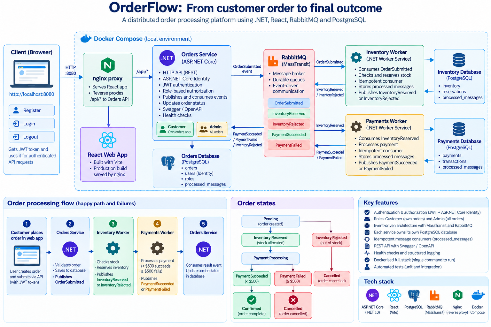

# OrderFlow

A local distributed order-processing MVP built with .NET 10, React, PostgreSQL, RabbitMQ, MassTransit, and Docker Compose.

## Architecture



Each service owns its own logical PostgreSQL database. Services communicate through immutable RabbitMQ integration events; they never access another service's database.

## Run locally

Prerequisites: .NET 10 SDK, Node.js 24+, and Docker Desktop with the Linux engine running.

1. Create local Docker credentials:

   ```powershell
   Copy-Item .env.example .env
   ```

   Set non-production values for `POSTGRES_PASSWORD`, `RABBITMQ_PASSWORD`, and a 32-character-or-longer `JWT_KEY` in `.env`. Do not commit this file.

2. Start the complete application:

   ```powershell
   docker compose up --build
   ```

   Open `http://localhost:8080`, register a customer account, then create an order. Nginx serves the React dashboard and proxies its `/api` requests to Orders. RabbitMQ management is available at `http://localhost:15672`; the Orders API is exposed for diagnostics at `http://localhost:8081`.

3. For Vite development instead of the production web container:

   ```powershell
   Set-Location src/Web/orderflow-web
   $env:VITE_ORDERS_API_PROXY_TARGET = 'http://localhost:8081'
   npm install
   npm run dev
   ```

   Open `http://localhost:5173`. The production frontend always uses relative `/api` requests; nginx routes them to the Compose Orders service.

## Workflow

Create an order with a seeded SKU such as `KB-001`, `MS-001`, or `MON-001`. Inventory reserves stock idempotently. Payments succeeds for totals below $500 and fails for totals of $500 or more; Orders then becomes `Confirmed` or `Cancelled`.

## Verification

```powershell
dotnet restore
dotnet build OrderFlow.slnx --no-restore
dotnet test OrderFlow.slnx --no-build --no-restore

Set-Location src/Web/orderflow-web
npm run lint
npm run build
```

## API

- `POST /api/auth/register` registers a Customer and returns a JWT.
- `POST /api/auth/login` returns a JWT for valid credentials.
- `GET /api/auth/me` returns the authenticated user.
- `POST /api/orders` creates an order for the authenticated Customer.
- `GET /api/orders/{id}` retrieves the caller's order; Admins can retrieve any order.
- `GET /api/orders?take=20` lists the caller's orders; Admins receive all orders.
- `GET /health` reports Orders API health.
